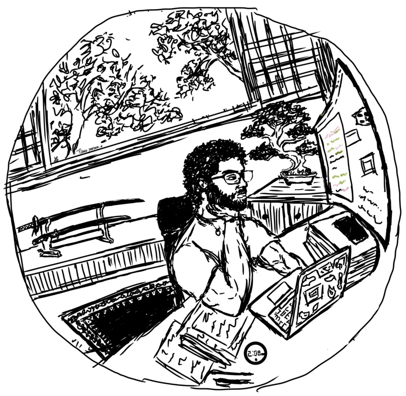

<div align="center">

<table>
<tr>
<td width="45%">


</td>

<td width="55%">

### Computer Science Engineer

```text
Currently:
  → PUCMM Computer Science Engineer (graduate)
  → Lead developer @ ClimaCall (Spring Boot + Vaadin)
  → Capstone: Socratic Tutor (guided chat + visual C debugger)
  
Philosophy:
  Clean code. Keyboard-driven. Pragmatic Decisions. Neovim or nothing.

```

</td>
</tr>
</table>

</div>

## 技術 Tech Stack

<p align="center">


</p>

## 現在 Current Focus

Building **[ClimaCall](https://www.climacall.com)**, a management platform tailored for HVAC companies. I am part of a small, agile team focused on delivering a robust solution for service tracking and business operations.

**My Role:** Lead developer. I **collaborate** on the end-to-end lifecycle, from **aligning on Data Models** and implementing **server-side logic** to refining the **frontend**. I review code and plan technical work with the team.

**The Stack:** Spring Boot · Vaadin Flow · PostgreSQL · Docker"

## 活動 GitHub Activity

<table width="100%">
<tr>
<td width="340">

</td>

<td valign="top">
<h2>活動 GitHub Activity</h2>


<br /><br />

<h2>その他 Other Work</h2>

<p>
<strong>
<a href="https://cristiandelahoz.me/stories/en/socratic-tutor/">Socratic Tutor</a>
</strong>
- An AI-assisted learning platform from our capstone project. I built the guided conversation, AI orchestration, and visual C debugger; my partner built the activities feature.
<br />
<strong>Tech:</strong> Spring Boot · Vaadin Flow · Spring AI · PostgreSQL
</p>

<p>
<strong>
<a href="https://cristiandelahoz.me/stories/en/pokedex/">Pokédex</a>
</strong>
- A Flutter Pokédex with search, Pokémon profiles, favorites, trivia, and interactive evolution graphs built from PokéAPI data.
<br />
<strong>Tech:</strong> Flutter · GraphQL · PokéAPI
</p>

<p>
<strong>
<a href="https://cristiandelahoz.me/stories/en/chatzam/">Chatzam</a>
</strong>
- My first mobile project: a native Android messaging app built while learning reactive events and the Android ecosystem.
<br />
<strong>Tech:</strong> Java · Firebase · Android
</p>

<p>
<strong>
<a href="https://github.com/cristiandlahoz/zoolan-vetmgmt">Zoolan</a>
</strong>
- A veterinary clinic management system built for a real-world client to streamline patient records and appointment scheduling.
<br />
<strong>Tech:</strong> Spring Boot · Vaadin Flow · PostgreSQL
</p>

<p>
<strong>
<a href="https://github.com/cristiandlahoz/markdown-powered-blog">Markdown-Powered Blog</a>
</strong>
- Next.js blog with animated sidebar navigation. Built to learn Next.js SSG and TypeScript.
<br />
<strong>Tech:</strong> Next.js · TypeScript · Tailwind CSS
</p>

<p>
<em>"Write code like you're crafting a katana - precise, elegant, deadly."</em>
</p>
</td>
</tr>
</table>

<p align="center">

</p>
